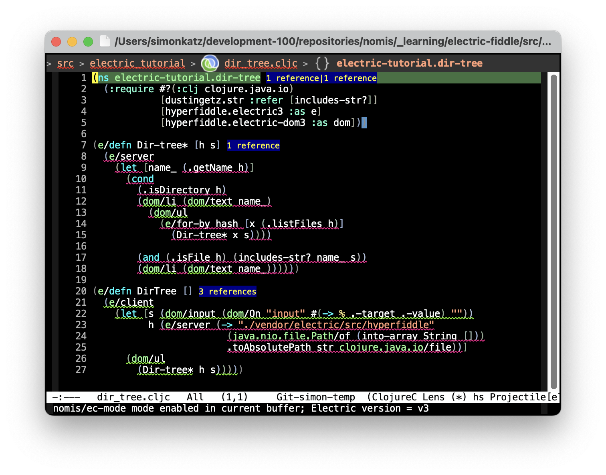

# Introduction

This is an Emacs minor mode for [Electric Clojure](https://github.com/hyperfiddle/electric). It colors client and server sites in source code.

Here's an example (code taken from [dir-tree example at Electric v3 tutorial](https://electric.hyperfiddle.net/tutorial/dir_tree)):


See the [Screenshot Gallery](docs/screenshot-gallery.md) for more examples.


# Installation

## Prerequisites

nomis-electric-clojure depends on the parseclj Emacs library. I've been using version 20231203.1905 successfully.

I don't know how to package up Emacs libraries — how to specify dependencies etc — so for now you will have to separately make sure that parseclj is available.  (TODO: Improve this.)

## Installing nomis-electric-clojure itself

Here are some options for installing nomis-electric-clojure itself:

### Option 1

Copy the file `nomis-electric-clojure.el` to a place where it will be found by your Emacs and add the following to your init file:

```
  (require 'nomis-electric-clojure)
```

### Option 2

For Emacs 30+:

```
(use-package nomis-electric-clojure
  :vc (:url "https://github.com/simon-katz/nomis-electric-clojure-mode"
       :rev "newest")
  :ensure t)
```

## A Note About Updating nomis-electric-clojure

When you update `nomis-electric-clojure.el` to a new version, it is safest to restart Emacs rather than just evaluating the new code.


# How nomis-electric-clojure Recognises Electric Buffers

nomis-electric-clojure checks for Electric buffers by looking for one of the following near the start:

  - `[hyperfiddle.electric :as e]` (⇒ Electric v2)
  - `[hyperfiddle.electric3 :as e]` (⇒ Electric v3)

There's a customizable variable, `nomis/ec-bound-for-electric-require-search` (default 10000), that specifies how many characters into a buffer to search before giving up.


# Turning on nomis-electric-clojure-mode

By default, the mode is turned on automatically for any `.cljc` buffer that is recognised to be Electric source code. You can disable this by customizing `nomis/ec-auto-enable?`.

To turn the mode on or off manually, run `M-x nomis-electric-clojure-mode`. If the mode can't determine the Electric version, it assumes v3.


# Overview of Features

nomis-electric-clojure-mode does the following:

- Auto-detects whether the code is Electric v2 or Electric v3. (If auto-detect fails, v3 is assumed.)

- Applies different colors to client regions and server regions.

- Does not apply a color to regions that may be either client or server.

- Provides an extension mechanism so that you can teach the mode about user-land binding macros.

The mode analyses each Electric function separately — it does not look at the call tree. So regions of code that are not colored may in fact always run on one site.


# A Suggestion

The colors of nomis-electric-clojure-mode can it hard to read your code and any feedback provided by other modes, so you will at least sometimes want to turn it off. You might even choose to generally have the mode off and only turn it on when you want to focus on what's on the client and what's on the server.

In any case it's useful to be able to turn the mode off and on very quickly, so I suggest setting up a keyboard shortcut for this. See the [Keyboard Shortcuts](#keyboard-shortcuts) section.


# Coloring Initial Whitespace

By default, initial whitespace is not colored.

You can change this by customizing `nomis/ec-color-initial-whitespace?` and you can toggle this on-the-fly with `M-x nomis/ec-toggle-color-initial-whitespace`.

Here's an example:


# Using Underlining Instead of Background

By default, client and server regions have colored backgrounds. Sometimes this can make your code hard to read.

You can use underlining instead by customizing `nomis/ec-use-underline?` and you can toggle this on-the-fly with `M-x nomis/ec-toggle-use-underline`.

Here's an example:




# Cycling Through Combinations of Options

You can cycle through combinations of `nomis/ec-color-initial-whitespace?` and `nomis/ec-use-underline?` using `M-x nomis/ec-cycle-options`.


# Keyboard Shortcuts

I use the following keyboard shortcuts:

```
(define-key clojure-mode-map (kbd "M-E") 'nomis-electric-clojure-mode)
(define-key clojure-mode-map (kbd "C-M-e") 'nomis/ec-cycle-options)
```

# Adding New Parser Specs

The mode provides an extension mechanism.

See the function `nomis/ec-add-parser-spec` and the definition of the built-in parsers at the end of the source file.

Time will tell how useful this is. Perhaps the mechanism will need to be extended.

For a taste, here are some examples of built-in parser definitions:

```
(nomis/ec-add-parser-spec '(:operator "e/client"
                            :site     :client
                            :apply-to whole
                            :shape    (operator
                                       body)))

(nomis/ec-add-parser-spec '(:operator "e/server"
                            :site     :server
                            :apply-to whole
                            :shape    (operator
                                       body)))

(nomis/ec-add-parser-spec '(:operator "let"
                            :shape    (operator
                                       let-bindings
                                       body)))

(nomis/ec-add-parser-spec '(:operator "e/for"
                            :shape    (operator
                                       let-bindings
                                       body)))

(nomis/ec-add-parser-spec '(:operator "e/for-by"
                            :shape    (operator
                                       key-function
                                       let-bindings
                                       body)))

(nomis/ec-add-parser-spec '(:operator       "dom/"
                            :no-symbol-end? t
                            :site           :client
                            :apply-to       operator
                            :shape          (operator
                                             body)))
```


# Troubleshooting

## The Coloring Changes When I Add or Remove Whitespace

I've sometimes seen Emacs overlays get muddled and the coloring flip between being correct and incorrect when I simply change whitespace. I've found that restarting Emacs makes the problem go away. (TODO: That's a bit drastic. Next time it happens: Does it happen in just one buffer? What happens if you kill the buffer and re-open the file?)


## nomis-electric-clojure-mode thinks code is v3 but actually it's v2, or vice versa

This can happen in a newly-created file or if the `:require` form in the namespace declaration is changed.

You can re-run the auto-detection of the version in any of the following ways:

- by running `M-x nomis/ec-redetect-electric-version`

- by turning the mode off and then back on (by running `M-x nomis-electric-clojure-mode` twice)

- by reverting the buffer.


# Remaining Work

For Electric v2 I don't think there's anything further to do.

For Electric v3:

- Currently `binding` is handled the same as `let`. Is that correct?

- Need to understand metadata (at least its existence).

- Need to handle multiple arities in `e/defn` and `e/fn`.

- I still need to finish going through the Electric v3 tutorial. I think I may want to add understanding of the contents of the `hyperfiddle.electric-forms3` namespace, or at least some of it.

- Quite possibly other things that I haven't realised yet.


# Contributing

See [Contribution guidelines for this project](docs/CONTRIBUTING.md).
